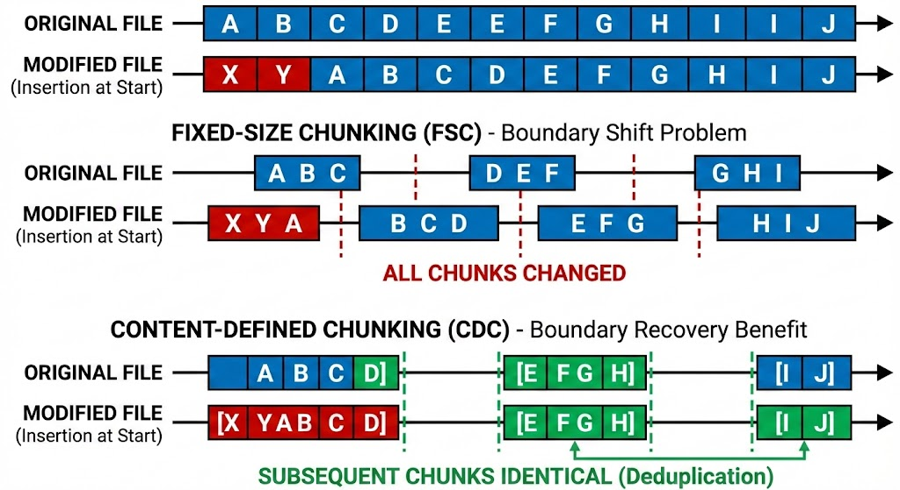

Content-Defined Chunking (CDC) is a method used to break a large file or stream of data into smaller pieces, called "chunks," based on the actual data inside the file rather than a specific size or byte count.

CDC is primarily used in data centrics systems where **efficiency** is critical by **deduplicating** redundant data, for example:

- **Data Deduplication:** In backup systems (like [[restic]] or Borg). If you modify just one sentence in a large file, CDC allows the system to recognize that most of the other chunks haven't changed, so it doesn't need to store them again.
- **Network Synchronization:** Tools like rsync use similar principles to only send the parts of a file that have changed, saving massive amounts of bandwidth.

Content-Defined Chunking are one of the key primitives of [[Prolly Trees]].

## Compared to fixed-size chunking

CDC improves deuduplication compared to **Fixed-Size Chunking**, where the data is chunked based on absolute offsets, i.e. every x bytes. For example, a large file’s chunks change completely if the file is edited near the beginning. This drawback of fixed size chunking is also referred to as the **boundary shift problem** or **offset-sensitivity**.

## Rolling hash function

CDC strategies determine chunking boundaries based on the content. To do so they typically employ a rolling hash function and looks for patterns in the byte sequence.

## Deduplication Demo

<iframe width="100%" height="900" src="https://2color.github.io/content-defined-chunking-vis/"></iframe>

[Link to demo](https://2color.github.io/content-defined-chunking-vis/)

## Resrouces

- https://joshleeb.com/posts/content-defined-chunking.html
- https://blog.ktruong.dev/breaking-cdc/
- https://joelgustafson.com/posts/2023-05-04/merklizing-the-key-value-store-for-fun-and-profit#content-defined-chunking
