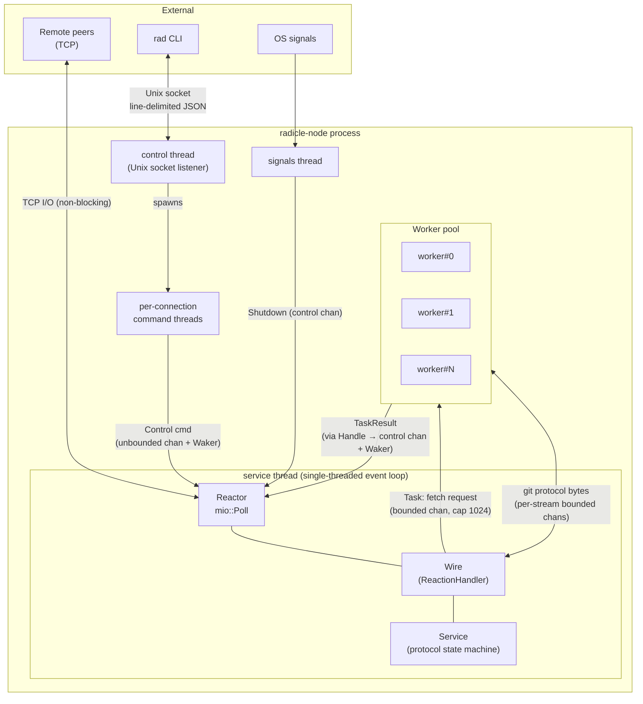
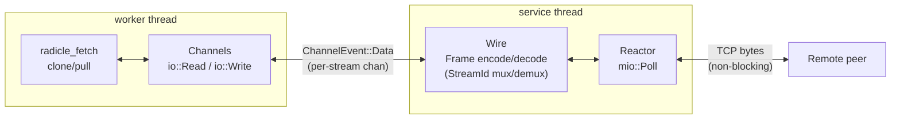
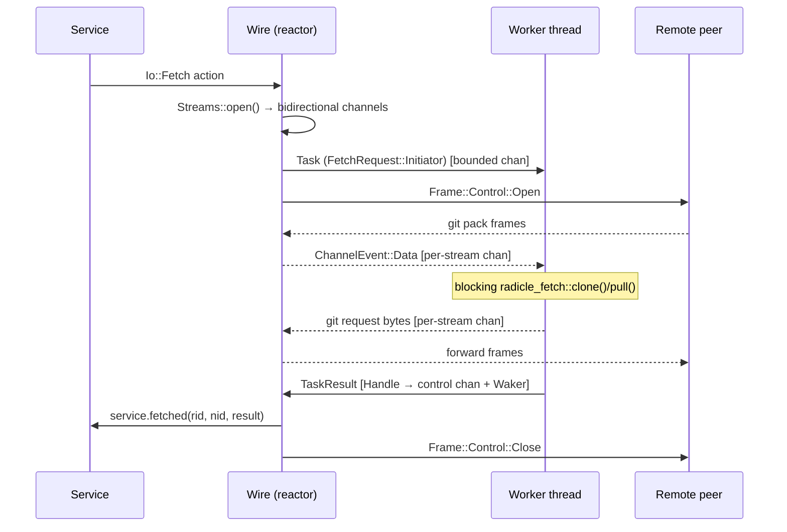

This document describes the high-level architecture and concurrency model
of `radicle-node`: the threads it runs, how they communicate, and how a
git fetch flows through the system. The networking event loop itself is
described in more detail in [event-loop.md](event-loop.md).

## Threads

The node is organised around a single core thread plus a few supporting
threads. State that belongs to the protocol lives entirely on the core
thread, so it needs no locking; blocking work is pushed out to a worker
pool.

- **`service`** — the core thread. Runs the reactor event loop, which
  drives the `Wire` (the protocol/wire-format handler) and, through it,
  the `Service` (the protocol state machine: gossip, repositories,
  peers). Spawned in `runtime.rs` via `Reactor::new`.
- **`control`** — listens on the Unix control socket for `rad` CLI
  commands and spawns a short-lived thread per connection. See
  `control.rs` and [control-protocol.md](control-protocol.md).
- **`signals`** — receives OS signals (SIGTERM/SIGINT/SIGHUP) and
  triggers graceful shutdown.
- **`worker#0..N`** — a fixed pool (size `config.workers`) of threads
  that perform blocking git fetch/clone/pull operations. Spawned in
  `worker.rs`.

## Component diagram



## Channels

All cross-thread communication is by message passing over channels; the
reactor is woken from its `poll()` via an mio `Waker`.

- **Control channel** (unbounded) — the single entry point back into the
  reactor. Control commands from the CLI, worker results, and shutdown
  signals all funnel into it (`reactor.rs`), each followed by a wake.
- **Worker task channel** (bounded, cap 1024) — `Wire` → worker pool.
  Carries a `Task` describing a fetch to perform (`runtime.rs`).
- **Worker result path** — worker → reactor. A worker reports a
  `TaskResult` back through the `Handle`, which enqueues it on the
  control channel (`runtime/handle.rs`).
- **Per-stream channels** (bounded, cap 64) — bidirectional git protocol
  bytes between `Wire` and a worker for the duration of a fetch, keyed by
  `StreamId` (`worker/channels.rs`).

### Where the worker channels are created

There are two distinct sets of channels for talking to the workers,
created in different places and at different times.

1. **The task channel is created once, at startup**, in
   `Runtime::init` (`runtime.rs`):

   ```rust
   let (worker_send, worker_recv) = chan::bounded::<worker::Task>(MAX_PENDING_TASKS);
   ```

   `worker_recv` is cloned into every worker thread, so they all receive
   from the same channel — it acts as a work-stealing queue. `worker_send`
   is held by `Wire` to dispatch tasks.

2. **The per-stream channels are created per fetch**, in
   `Channels::pair` (`worker/channels.rs`):

   ```rust
   let (l_send, r_recv) = chan::bounded::<ChannelEvent<T>>(MAX_WORKER_CHANNEL_SIZE);
   let (r_send, l_recv) = chan::bounded::<ChannelEvent<T>>(MAX_WORKER_CHANNEL_SIZE);
   ```

   Two channels are created because the git stream is bidirectional: one
   carries `Wire` → worker, the other worker → `Wire`. They are bundled
   into two `Channels` halves — one half stays with `Wire`, the other is
   moved into the `Task` sent to the worker. `pair` is called from `Wire`
   when a stream is opened or registered (`Streams::open` / `register` in
   `wire.rs`).

## How workers reach the network

A worker never touches the TCP socket. The reactor is the sole owner of
the socket; the worker only ever reads and writes its per-stream
channels, and `Wire` relays between the two.

The `Channels` handed to a worker expose `io::Read`/`io::Write` (via
`ChannelReader`/`ChannelWriter` in `worker/channels.rs`), so the git
fetch code believes it is doing ordinary blocking socket I/O — but those
reads and writes are backed by channels, not the network. `Wire`
translates in both directions:

- **Worker → peer.** The worker writes git bytes into its channel.
  `Wire` drains them (`flush` in `wire.rs`), wraps each chunk in a wire
  `Frame::git(stream, data)`, and emits a `reactor::Action::Send`; the
  reactor performs the actual TCP write.
- **Peer → worker.** The reactor reads from the socket and hands the
  bytes to `Wire` as a `SessionEvent::Data`. `Wire` decodes the frames
  and, for a git frame, pushes the payload into the matching stream's
  channel (`channels.send(ChannelEvent::Data(..))`). The worker, blocked
  in `ChannelReader::read`, wakes and consumes it.



Two consequences follow:

- **Multiplexing.** A single TCP connection to a peer carries many
  concurrent git streams plus gossip. `Wire` tags every git frame with a
  `StreamId`, which is how it demultiplexes inbound bytes to the right
  worker channel and tags outbound bytes back onto the right stream.
- **No blocking on the core thread.** The worker blocks on channel reads
  (on its own thread), while the reactor only ever does non-blocking
  socket I/O and quick channel sends. Neither blocks the other.

## Git fetch flow

Git operations are blocking, so they run on the worker pool rather than
on the core thread. While a fetch is in flight, network frames are
relayed between `Wire` and the worker over the per-stream channels.



An incoming fetch (where a peer fetches from us) follows the mirror of
this: `Wire` receives a `Frame::Control::Open`, registers a stream and
dispatches a `Task` with `FetchRequest::Responder`, then forwards
incoming frames to the worker over the per-stream channel until the
worker produces a result.

## Why it's structured this way

- **No locks in the hot path.** All protocol state lives on the single
  `service` thread, so the reactor, `Wire`, and `Service` never contend
  on shared state. The reactor multiplexes many connections on that one
  thread.
- **Blocking work is isolated.** Git fetches would stall the event loop,
  so they are handed to the worker pool and their results delivered back
  asynchronously through the control channel.
- **One synchronization point.** Everything that needs to re-enter the
  core thread — CLI commands, worker results, shutdown — arrives through
  the reactor's control channel and wakes it via the mio `Waker`.