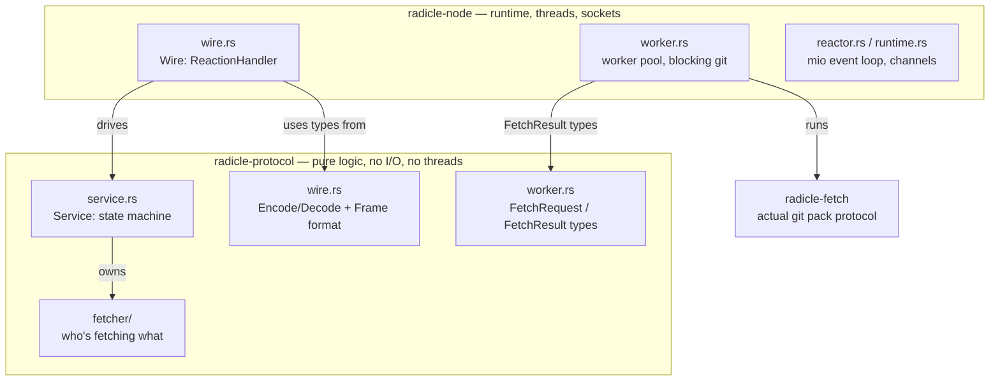
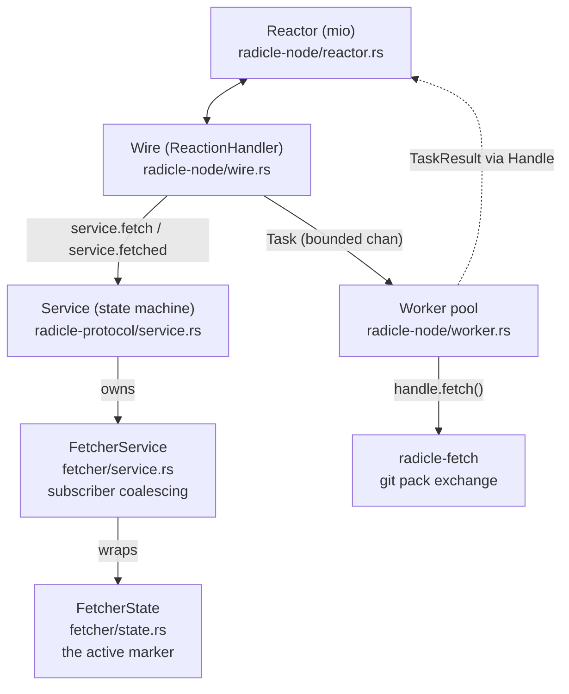
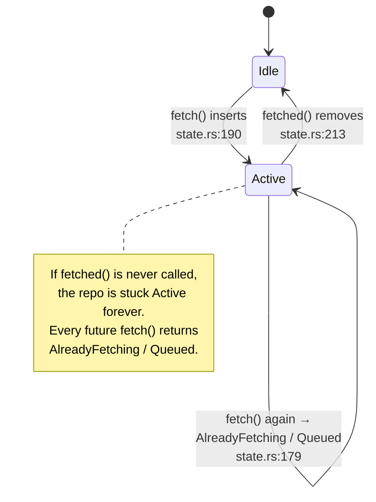
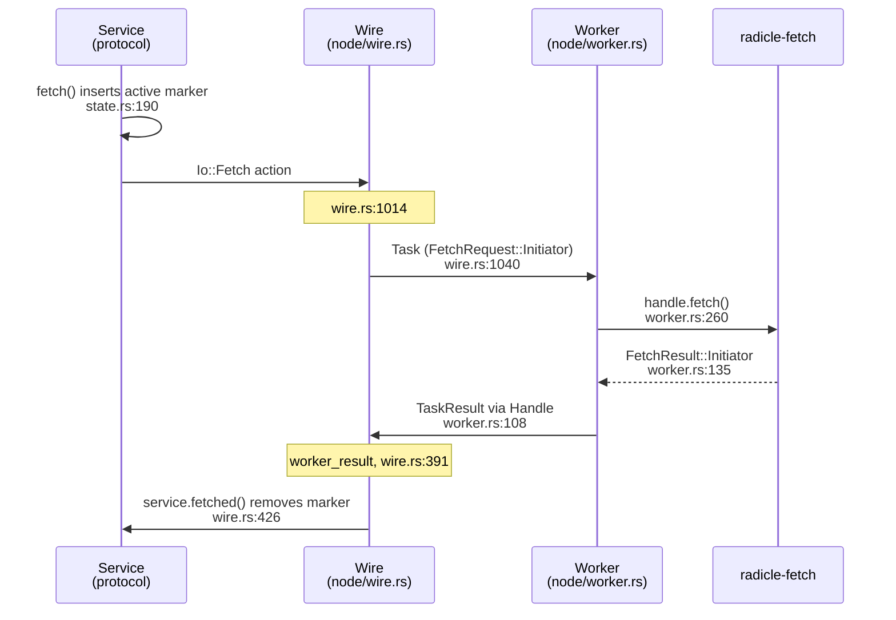

This document maps the code that drives a git fetch onto the crates and
modules it lives in. It complements [architecture.md](architecture.md),
which describes the threads and channels at runtime. Here the focus is
*where the code lives* and *why it's split the way it is*, using the
fetch path as the worked example.

## The big split: protocol vs runtime

The single most important thing to internalise is that the protocol
brain and the OS-facing body live in two different crates.

- **`radicle-protocol`** is pure logic: state machines, the wire format,
  message types. It does no I/O, owns no threads, and touches no
  sockets. This is what makes it testable in isolation.
- **`radicle-node`** is the runtime: the mio reactor, the worker thread
  pool, the control socket, and the glue that drives the protocol crate.



The seam between the two crates is a single re-export in
[`radicle-node/src/lib.rs`](../crates/radicle-node/src/lib.rs#L11):

```rust
pub(crate) use radicle_protocol::service;
```

So when node code refers to `crate::service::Service`, it is literally
`radicle_protocol`'s `Service`. The node crate re-exports the protocol
crate and wraps it with threads and sockets.

### Two files called `wire.rs`

A common source of confusion: there are two `wire.rs` files, and they do
different jobs.

| File | Responsibility |
|---|---|
| [`radicle-protocol/src/wire.rs`](../crates/radicle-protocol/src/wire.rs) | The wire *format* only: the [`Encode`](../crates/radicle-protocol/src/wire.rs#L117)/[`Decode`](../crates/radicle-protocol/src/wire.rs#L131) traits and the `Frame` types. No threads. |
| [`radicle-node/src/wire.rs`](../crates/radicle-node/src/wire.rs#L297) | The `Wire` struct, the reactor's `ReactionHandler`. The glue that talks to sockets and the worker pool. |

When [architecture.md](architecture.md) refers to "the `Wire`", it means
the node-side reaction handler, not the protocol-side wire format.

## The layers around a fetch

A fetch passes through several layers. The protocol crate provides the
top of the stack (decision making), the node crate provides the bottom
(execution).



### The fetcher onion

The `fetcher` module inside `radicle-protocol` is itself a three-layer
onion. Each layer has a single job, and the boundaries are deliberate so
the innermost layer can be tested as a pure state machine.

| Layer | File | Job |
|---|---|---|
| `Service` | [`service.rs:1057`](../crates/radicle-protocol/src/service.rs#L1057) (`fetched()`) | Translates worker results into protocol events: announces inventory, updates routing, emits events. |
| `FetcherService` | [`fetcher/service.rs:22`](../crates/radicle-protocol/src/fetcher/service.rs#L22) | Coalesces multiple waiters ("subscribers") on the same `(rid, node, refs)` fetch. |
| `FetcherState` | [`fetcher/state.rs:121`](../crates/radicle-protocol/src/fetcher/state.rs#L121) | The pure state machine: the `active` map plus per-node `queues`. |

`FetcherState` is a clean command to event machine
([`fetcher/state.rs:153`](../crates/radicle-protocol/src/fetcher/state.rs#L153),
`handle()`), which is why its tests live right beside it under
[`fetcher/test/`](../crates/radicle-protocol/src/fetcher/test).

## The active marker

For any repository there can be at most one fetch in flight. The fetcher
enforces this with a single map at
[`fetcher/state.rs:123`](../crates/radicle-protocol/src/fetcher/state.rs#L123):

```rust
active: BTreeMap<RepoId, ActiveFetch>,
```

Its entire lifecycle is two methods.



- Inserted at [`state.rs:190`](../crates/radicle-protocol/src/fetcher/state.rs#L190)
  when a fetch starts (`event::Fetch::Started`).
- The guard at [`state.rs:179`](../crates/radicle-protocol/src/fetcher/state.rs#L179):
  if the repo is already in `active`, return `AlreadyFetching` or
  enqueue. This deduplication is what *makes* the marker a trap if it is
  never cleared.
- Removed **only** by [`state.rs:213`](../crates/radicle-protocol/src/fetcher/state.rs#L213),
  `fetched()`.

If `fetched()` is never called, the map entry is immortal and the repo
can never be fetched again until the node restarts.

## End-to-end flow

The clean path always ends in `service.fetched()`, which removes the
active marker. The diagram below shows the file and line where each hop
lives.



The two crates meet at exactly two points in this flow:

1. `Service` emits an `Io::Fetch` action, which the node's `Wire` turns
   into a `Task` for the worker pool
   ([`wire.rs:1014`](../crates/radicle-node/src/wire.rs#L1014)).
2. The worker reports a `TaskResult` back through the `Handle`, which the
   node's `Wire` turns into a `service.fetched()` call
   ([`wire.rs:391`](../crates/radicle-node/src/wire.rs#L391)).

Everything between those two points is execution (threads, sockets, git);
everything outside them is protocol logic.

## Where it can leak

Two disconnect-timing edge cases can short-circuit the flow *before*
`service.fetched()` runs, leaving the active marker stuck. Both live in
the node's `wire.rs`, on the boundary between the runtime and the
protocol.

**Leak 1 — fetch dispatch**, [`wire.rs:1023`](../crates/radicle-node/src/wire.rs#L1023):

```rust
let Some((fd, Peer::Connected { link, streams, .. })) = self.peers.lookup_mut(&remote)
else {
    log::debug!(target: "wire", "Peer {remote} is not connected: dropping fetch");
    continue;   // marker already inserted at state.rs:190, never removed
};
```

**Leak 2 — worker result**, [`wire.rs:416`](../crates/radicle-node/src/wire.rs#L416):

```rust
} else {
    log::debug!(target: "wire", "Peer {nid} is not connected; ignoring fetch result");
    return;   // returns before service.fetched()
};
```

There is also a legitimate cleanup path that *does* clear state on
disconnect: [`wire.rs:470`](../crates/radicle-node/src/wire.rs#L470)
(`cleanup()`) calls `service.disconnected()`, which in the protocol calls
`fetcher.cancel()`
([`fetcher/state.rs:234`](../crates/radicle-protocol/src/fetcher/state.rs#L234)).
The bug is that the two leak points can race ahead of, or bypass, that
path: a late worker result or a queued `Io::Fetch` arrives for a peer
that is already gone, and the early `return`/`continue` skips both
`fetched()` and `cancel()`.

## Suggested reading order

To build understanding from the inside out:

1. [`fetcher/state.rs`](../crates/radicle-protocol/src/fetcher/state.rs) —
   small, pure, no I/O. The `active`/`queues`/`Config` model and
   `fetch`/`fetched`/`cancel`/`dequeue`.
2. [`fetcher/service.rs`](../crates/radicle-protocol/src/fetcher/service.rs) —
   the subscriber layer wrapped around it.
3. [`service.rs:1057`](../crates/radicle-protocol/src/service.rs#L1057)
   (`fetched()`) and the nearby `Io::Fetch` emission — how the state
   machine becomes I/O.
4. [`radicle-node/src/wire.rs`](../crates/radicle-node/src/wire.rs) —
   `worker_result` ([391](../crates/radicle-node/src/wire.rs#L391)), the
   `Io::Fetch` handler ([1014](../crates/radicle-node/src/wire.rs#L1014)),
   and `cleanup` ([470](../crates/radicle-node/src/wire.rs#L470)). The
   reactor-facing glue.
5. [`radicle-node/src/worker.rs`](../crates/radicle-node/src/worker.rs) —
   `process`/`_process`
   ([92](../crates/radicle-node/src/worker.rs#L92)/[125](../crates/radicle-node/src/worker.rs#L125))
   and the `handle.fetch()` call into `radicle-fetch`
   ([260](../crates/radicle-node/src/worker.rs#L260)).